# Entity Relationship Diagram

Visual overview of all data models in the fynance API. Color coding:

- **Green**: Agreed and implemented (in schema + backend code)
- **Yellow**: Planned or open question (proposed in handover doc, needs decision)

```mermaid
erDiagram
    %% ━━━ AGREED & IMPLEMENTED (green) ━━━━━━━━━━━━━━━━━━━━━━━━━━━━━━━━━━━

    Profile {
        TEXT id PK "e.g. 'alex', 'sam', 'default'"
        TEXT name "Display name"
    }

    Account {
        TEXT id PK "e.g. 'monzo-current'"
        TEXT name "Display name"
        TEXT institution "Monzo, Revolut, Lloyds, etc."
        TEXT type "checking|savings|investment|credit|cash|pension"
        TEXT currency "Default: GBP"
        TEXT balance "Decimal string, latest known"
        TEXT balance_date "YYYY-MM-DD, last update"
        INTEGER is_active "1 = active"
        TEXT notes "Optional"
        JSON profile_ids "FK array to Profile.id"
    }

    Transaction {
        TEXT id PK "UUID v4"
        TEXT date "YYYY-MM-DD"
        TEXT description "Raw merchant string"
        TEXT normalized "Cleaned for display"
        TEXT amount "Decimal string, neg = debit"
        TEXT currency "Source currency"
        TEXT account_id FK "FK to Account.id"
        TEXT category "Parent: Child, nullable"
        TEXT category_source "rule|agent|manual"
        REAL confidence "0.0-1.0, nullable"
        TEXT notes "User annotation"
        INTEGER is_recurring "1 = recurring"
        TEXT fingerprint UK "SHA-256 dedup"
        TEXT fitid "OFX FITID if present"
        TEXT created_at "ISO timestamp"
    }

    Holding {
        INTEGER id PK "Auto-increment"
        TEXT account_id FK "FK to Account.id"
        TEXT symbol "Ticker/ISIN, e.g. VWRL"
        TEXT name "Full display name"
        TEXT short_name "Compact label for charts"
        TEXT holding_type "stock|etf|fund|bond|crypto|cash"
        TEXT quantity "Decimal string (shares/units)"
        TEXT price_per_unit "Decimal, nullable"
        TEXT value "Decimal, total value"
        TEXT currency "Source currency"
        TEXT as_of "YYYY-MM-DD snapshot date"
        TEXT created_at "ISO timestamp"
    }

    PortfolioSnapshot {
        INTEGER id PK "Auto-increment"
        TEXT snapshot_date "YYYY-MM-DD"
        TEXT account_id FK "FK to Account.id"
        TEXT balance "Decimal string"
        TEXT currency "Source currency"
    }

    Budget_Standing {
        INTEGER id PK "Auto-increment"
        TEXT category UK "One per category"
        TEXT amount "Decimal string, monthly target"
    }

    Budget_Override {
        INTEGER id PK "Auto-increment"
        TEXT month "YYYY-MM"
        TEXT category "Matches standing_budgets.category"
        TEXT amount "Decimal string, override target"
    }

    SectionMapping {
        TEXT section "Income|Bills|Spending|Irregular|Transfers"
        TEXT category UK "Budget category name"
    }

    ImportLog {
        INTEGER id PK "Auto-increment"
        TEXT filename "Source file name"
        TEXT account_id FK "FK to Account.id"
        INTEGER rows_total "Total rows parsed"
        INTEGER rows_inserted "New rows added"
        INTEGER rows_duplicate "Skipped duplicates"
        TEXT source "csv|screenshot|api"
        TEXT detected_bank "monzo|revolut|lloyds|unknown"
        REAL detection_confidence "0.0-1.0"
        TEXT imported_at "ISO timestamp"
    }

    IngestionChecklist {
        INTEGER id PK "Auto-increment"
        TEXT month "YYYY-MM"
        TEXT account_id FK "FK to Account.id"
        TEXT status "pending|completed|skipped"
        TEXT completed_at "ISO timestamp, nullable"
        TEXT notes "Optional"
    }

    ApiToken {
        INTEGER id PK "Auto-increment"
        TEXT name UK "Token display name"
        TEXT token_hash "SHA-256 of raw token"
        TEXT created_at "ISO timestamp"
        TEXT last_used "ISO timestamp, nullable"
        INTEGER is_active "1 = active"
    }

    %% ━━━ PLANNED / OPEN QUESTIONS (yellow) ━━━━━━━━━━━━━━━━━━━━━━━━━━━━━

    ExchangeRate {
        INTEGER id PK "Auto-increment"
        TEXT from_currency "e.g. USD"
        TEXT to_currency "e.g. GBP (user preferred)"
        TEXT rate "Decimal string"
        TEXT rate_date "YYYY-MM-DD"
        TEXT source "manual|api"
        TEXT captured_at "ISO timestamp"
    }

    %% ━━━ RELATIONSHIPS ━━━━━━━━━━━━━━━━━━━━━━━━━━━━━━━━━━━━━━━━━━━━━━━━━

    Profile ||--o{ Account : "owns (via profile_ids[])"
    Account ||--o{ Transaction : "account_id"
    Account ||--o{ Holding : "account_id"
    Account ||--o{ PortfolioSnapshot : "account_id"
    Account ||--o{ ImportLog : "account_id"
    Account ||--o{ IngestionChecklist : "account_id"
    Budget_Standing ||--o{ Budget_Override : "category (overrides per month)"
    SectionMapping }o--|| Budget_Standing : "category (display grouping)"
    ExchangeRate }o--o{ Holding : "currency + as_of (proposed join)"
```

## Status Legend

### Agreed and implemented (green nodes above)

| Entity | Notes |
|--------|-------|
| **Profile** | Multi-person household support. `profile_ids` on Account is agreed (JSON array, not join table). |
| **Account** | Core entity. Types: checking, savings, investment, credit, cash, pension. Frontend also uses property + mortgage types (not yet in backend enum). |
| **Transaction** | Created by CSV import. Deduplicated by fingerprint. `is_recurring` flag for budget projections. |
| **Holding** | Per-symbol detail within accounts. `short_name` added by frontend. `"cash"` added to HoldingType enum in Nonso's PR. |
| **PortfolioSnapshot** | Per-account balance history. Carry-forward semantics for missing dates. |
| **Budget (Standing + Override)** | Option C from handover doc: standing targets with per-month overrides. Agreed by Ope, implemented by Nonso. |
| **SectionMapping** | Maps categories to spending grid sections (Income, Bills, Spending, Irregular, Transfers). |
| **ImportLog** | Audit trail per import. LLM parser populates `detected_bank` and `detection_confidence`. |
| **IngestionChecklist** | Monthly progress tracker: "3 of 7 accounts updated for March". |
| **ApiToken** | Bearer tokens for programmatic/agent access. Hash-only storage. |

### Planned / open questions (yellow nodes above)

| Entity | Status | Decision needed from |
|--------|--------|---------------------|
| **ExchangeRate** | Proposed in handover doc. Store rate at ingestion time for historical multi-currency net worth. | Nonso |
| **PortfolioSnapshot consolidation** | Ope proposes dropping this table entirely and deriving account balances from `SUM(holdings)`. Would make all accounts require at least one cash holding. | Nonso |
| **Account types: property + mortgage** | Frontend uses these but backend `AccountType` enum only has checking, savings, investment, credit, cash, pension. | Nonso |

### Derived views (not stored, computed by API)

These are API response shapes built from the entities above, not separate tables:

| View | Built from |
|------|-----------|
| **PortfolioResponse** (net worth, breakdowns by type/institution/sector) | Account + Holding |
| **PortfolioHistoryRow** (available vs unavailable wealth per month) | PortfolioSnapshot (or Holding if consolidated) |
| **BudgetRow** (budgeted vs actual per category) | Budget_Standing + Budget_Override + Transaction |
| **SpendingGridRow** (category x period pivot) | Transaction + SectionMapping + Budget_Standing |
| **CashFlowMonth** (income vs spending per month) | Transaction |
| **CategoryTotal** (spend per category) | Transaction |
