# Entity Relationship Diagram

Visual overview of all data models in the fynance API.

**Color coding:**

- 🟢 **Green** — Agreed and shipped on `master`
- 🟡 **Yellow** — Proposed / pending decision (from handover, plan #13, or Appendix B)

Source of truth for shipped entities: [db/sql/schema.sql](../db/sql/schema.sql) and [db/sql/migrations/](../db/sql/migrations/).

```mermaid
flowchart TB
    %% ━━━ BAND 1: CORE (shipped) ━━━━━━━━━━━━━━━━━━━━━━━━━━━━━━━━━━━━━━━━
    subgraph core["🟢 Core"]
        direction TB
        profiles["<b>profiles</b><br/>──────────────<br/>id TEXT PK<br/>name TEXT"]:::shipped
        accounts["<b>accounts</b><br/>──────────────<br/>id TEXT PK<br/>name TEXT<br/>institution TEXT<br/>type TEXT<br/>currency TEXT<br/>balance TEXT Decimal<br/>balance_date TEXT<br/>is_active INTEGER<br/>notes TEXT<br/>profile_ids JSON FK→profiles"]:::shipped
        transactions["<b>transactions</b><br/>──────────────<br/>id TEXT PK UUID<br/>date TEXT ISO datetime<br/>description TEXT<br/>normalized TEXT<br/>amount TEXT Decimal<br/>currency TEXT<br/>account_id TEXT FK→accounts<br/>category TEXT<br/>category_source TEXT rule/agent/manual<br/>confidence REAL<br/>notes TEXT<br/>is_recurring INTEGER<br/>fingerprint TEXT UNIQUE<br/>fitid TEXT<br/>created_at TEXT"]:::shipped
        holdings["<b>holdings</b><br/>──────────────<br/>id INTEGER PK<br/>account_id TEXT FK→accounts<br/>symbol TEXT<br/>name TEXT<br/>short_name TEXT<br/>holding_type TEXT stock/etf/fund/bond/crypto/cash<br/>quantity TEXT Decimal<br/>price_per_unit TEXT Decimal<br/>value TEXT Decimal<br/>currency TEXT<br/>as_of TEXT<br/>created_at TEXT<br/>UNIQUE account_id,symbol,as_of"]:::shipped
        profiles --> accounts
        accounts --> transactions
        accounts --> holdings
    end

    %% ━━━ BAND 2: BUDGETS (shipped) ━━━━━━━━━━━━━━━━━━━━━━━━━━━━━━━━━━━━━
    subgraph budget["🟢 Budgets"]
        direction TB
        section_mappings["<b>section_mappings</b><br/>──────────────<br/>section TEXT<br/>Income/Bills/Spending/Irregular/Transfers<br/>category TEXT UNIQUE"]:::shipped
        standing_budgets["<b>standing_budgets</b><br/>──────────────<br/>id INTEGER PK<br/>category TEXT UNIQUE<br/>amount TEXT Decimal"]:::shipped
        budget_overrides["<b>budget_overrides</b><br/>──────────────<br/>id INTEGER PK<br/>month TEXT YYYY-MM<br/>category TEXT<br/>amount TEXT Decimal<br/>UNIQUE month,category"]:::shipped
        budgets_legacy["<b>budgets</b> (legacy)<br/>──────────────<br/>id INTEGER PK<br/>month TEXT<br/>category TEXT<br/>amount TEXT<br/>UNIQUE month,category<br/><i>superseded by standing_budgets + overrides</i>"]:::shipped
        section_mappings --> standing_budgets
        standing_budgets --> budget_overrides
        budget_overrides --> budgets_legacy
    end

    %% ━━━ BAND 3: OPS (shipped) ━━━━━━━━━━━━━━━━━━━━━━━━━━━━━━━━━━━━━━━━━
    subgraph ops["🟢 Ops and ingest"]
        direction TB
        import_log["<b>import_log</b><br/>──────────────<br/>id INTEGER PK<br/>filename TEXT<br/>account_id TEXT FK→accounts<br/>rows_total INTEGER<br/>rows_inserted INTEGER<br/>rows_duplicate INTEGER<br/>source TEXT<br/>detected_bank TEXT<br/>detection_confidence REAL<br/>imported_at TEXT"]:::shipped
        ingestion_checklist["<b>ingestion_checklist</b><br/>──────────────<br/>id INTEGER PK<br/>month TEXT YYYY-MM<br/>account_id TEXT FK→accounts<br/>status TEXT pending/completed/skipped<br/>completed_at TEXT<br/>notes TEXT"]:::shipped
        api_tokens["<b>api_tokens</b><br/>──────────────<br/>id INTEGER PK<br/>name TEXT UNIQUE<br/>token_hash TEXT SHA-256<br/>created_at TEXT<br/>last_used TEXT<br/>is_active INTEGER"]:::shipped
        import_log --> ingestion_checklist
        ingestion_checklist --> api_tokens
    end

    %% ━━━ BAND 4: PENDING ━━━━━━━━━━━━━━━━━━━━━━━━━━━━━━━━━━━━━━━━━━━━━━
    subgraph pending["🟡 Pending / proposed"]
        direction TB
        exchange_rates["<b>exchange_rates</b> ⏳<br/>──────────────<br/>id INTEGER PK<br/>from_currency TEXT<br/>to_currency TEXT<br/>rate TEXT Decimal<br/>rate_date TEXT<br/>source TEXT manual/api<br/>captured_at TEXT<br/>UNIQUE from,to,rate_date<br/><i>Plan 13 §3, handover §Currency</i>"]:::pending
        transaction_edits["<b>transaction_edits</b> ⏳<br/>──────────────<br/>id INTEGER PK<br/>transaction_id TEXT FK→transactions<br/>field TEXT category/notes<br/>old_value TEXT<br/>new_value TEXT<br/>changed_at TEXT<br/>changed_by TEXT user/agent<br/><i>Appendix B.4 audit trail</i>"]:::pending
        holdings_pots["<b>holdings</b> pot support ⏳<br/>──────────────<br/>Need one of:<br/>• drop fixed '_CASH' symbol; use meaningful symbols per pot<br/>• widen UNIQUE to account_id,symbol,name,as_of<br/>• add slot/label column in unique key<br/><i>Plan 13 §1 — pots/multi-currency</i>"]:::pending
        account_types_pending["<b>accounts.type</b> extension ⏳<br/>──────────────<br/>Add: property, mortgage<br/><i>Frontend uses these; backend enum missing them</i>"]:::pending
        tx_time_pending["<b>transactions.date</b> datetime-always ⏳<br/>──────────────<br/>Today: date-only CSVs zero to T00:00:00<br/>→ same-day same-amount tx collide on fingerprint<br/>Fix: synthesize distinct per-row time at import<br/><i>Appendix B.6 fingerprint collisions</i>"]:::pending
        tx_timezone_pending["<b>timezone policy</b> ⏳<br/>──────────────<br/>Today: NaiveDateTime stored without TZ<br/>Proposal: stamp user's TZ at ingestion<br/><i>Appendix B.2</i>"]:::pending
        exchange_rates --> transaction_edits
        transaction_edits --> holdings_pots
        holdings_pots --> account_types_pending
        account_types_pending --> tx_time_pending
        tx_time_pending --> tx_timezone_pending
    end

    %% Vertical chaining between bands so layout stays tall
    core --> budget
    budget --> ops
    ops --> pending

    classDef shipped fill:#c6f6d5,stroke:#22543d,stroke-width:1.5px,color:#1a202c
    classDef pending fill:#fef3c7,stroke:#92400e,stroke-width:1.5px,color:#1a202c
```

## Status Legend

### 🟢 Shipped and agreed

| Entity | Notes |
|--------|-------|
| **profiles** | Multi-person household support. Seeded with a "default" row on first startup. |
| **accounts** | Core entity. `profile_ids` is a JSON array (not a join table). Types: `checking`, `savings`, `investment`, `credit`, `cash`, `pension`. |
| **transactions** | Deduplicated by `fingerprint = sha256(date \| amount \| account_id)`. `is_recurring` flag for budget projections. |
| **holdings** | Per-symbol detail within accounts, plus cash balances as `symbol='_CASH'`, `holding_type='cash'`. Migration 004 consolidated `portfolio_snapshots` into this table (Option A of the consolidation proposal). `short_name` added for chart labels. |
| **standing_budgets + budget_overrides** | Option C from the handover: standing targets with per-month overrides. `COALESCE(override.amount, standing.amount)` gives the effective value. |
| **section_mappings** | Maps categories to spending grid sections (Income, Bills, Spending, Irregular, Transfers). |
| **import_log** | Audit trail per import. Migration 001 added `detected_bank` and `detection_confidence`. |
| **ingestion_checklist** | Monthly progress tracker: "3 of 7 accounts updated for March". |
| **api_tokens** | Bearer tokens for programmatic/agent access. Hash-only storage. |
| **budgets** (legacy) | Old per-month table. Superseded by `standing_budgets` + `budget_overrides` but not yet dropped. |

### 🟡 Pending / proposed

| Item | Source | Status |
|------|--------|--------|
| **exchange_rates** | Plan 13 §3, handover §Currency | Not shipped. Needed for multi-currency net worth with historical accuracy. |
| **transaction_edits** (audit log) | Appendix B.4 | Not shipped. `PATCH /api/transactions/:id` currently overwrites silently. Minimum ask: one row per changed field with old→new for revertability. |
| **holdings pots support** | Plan 13 §1 | Not shipped. `UNIQUE(account_id, symbol, as_of)` + fixed `_CASH` sentinel blocks Monzo pots and multi-currency balances. Pick Option A (meaningful symbols), B (widen UNIQUE), or C (new column). |
| **accounts.type: property, mortgage** | Handover §1.4 | Not shipped. Frontend already uses these; backend enum needs extending or frontend needs to stick to existing types. |
| **transactions.date: always datetime** | Appendix B.6 | Not fully shipped. CSVs with date-only dates still zero to `T00:00:00`, causing fingerprint collisions on same-day same-amount rows. Importer must synthesize distinct times per row. |
| **timezone policy** | Appendix B.2 | Not shipped. Naive timestamps through the whole stack. Proposal: stamp user's local TZ at ingestion time. |

### Derived views (not stored)

These API response shapes are built from the entities above, not separate tables:

| View | Built from |
|------|-----------|
| **PortfolioResponse** (net worth, breakdowns by type/institution/sector) | accounts + holdings |
| **PortfolioHistoryRow** (available vs unavailable wealth per month) | holdings (with carry-forward) |
| **BudgetRow** (budgeted vs actual per category) | standing_budgets + budget_overrides + transactions |
| **SpendingGridRow** (category × period pivot) | transactions + section_mappings + standing_budgets |
| **CashFlowMonth** (income vs spending per month) | transactions |
| **CategoryTotal** (spend per category) | transactions |
| **BalanceDelta** (first/last balance per account in a range, via `?summary=true`) | holdings |
