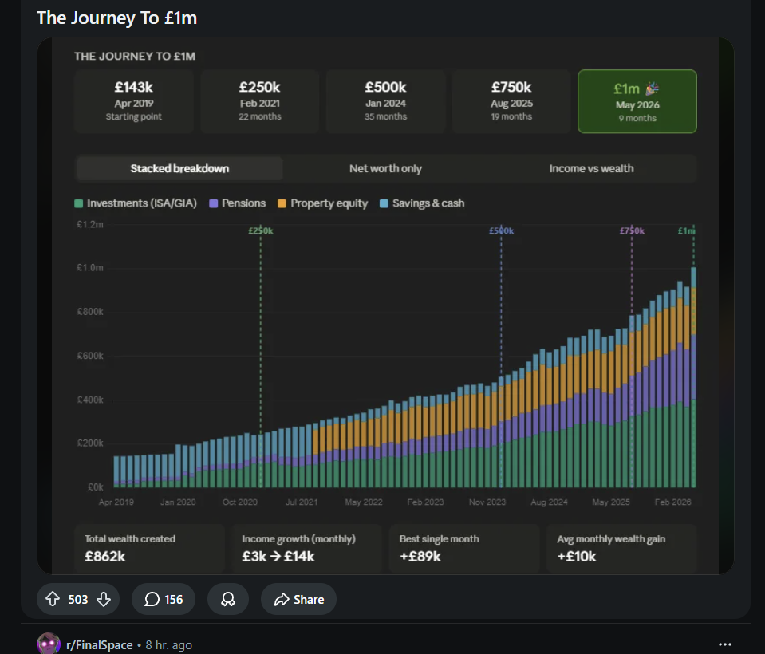

# Future Plans

Post-V0 improvements grouped by urgency. Items copied here from the V0 burndown are marked with version tags. Items that originated from earlier closed plans note their source.

---

## V1 (Immediate next steps after V0)

### Features
- [ ] **Custom tags/labels on accounts:** Add a `tags: string[]` field to `accounts` for user-defined free-form labels (e.g. "locked-until-2027", "joint-expenses", "rewards-card"). Sits alongside the fixed `account_type` enum and `profile_ids` array to allow softer categorisation that doesn't fit a type. Surfaced as filter chips on the accounts grid and as optional groupings in summary breakdowns. Originally raised in `archive/18_project_brief.md` Open Questions.
- [ ] **ISA allowance tracking:** Per-account annual allowance cap (e.g. £20,000 for a Stocks ISA). Track how much has been deposited in the current tax year vs. the limit. Show a progress bar + remaining allowance in the account detail sheet. Tax year resets on 6 April. Allowance is per-account-type (S&S ISA, Cash ISA, LISA each have separate rules). UI: a small "ISA" badge on the account card that turns amber/red as the limit approaches.
- [ ] **Mortgage overpayment allowance tracking:** Per-account annual overpayment cap (typically 10% of outstanding balance, but user-configurable). Track total overpayments made in the current mortgage year vs. the cap. Show remaining headroom in the account sheet. Trigger: a holding or account-level `overpayment_limit` field (absolute amount or % of balance, with a year-start date). UI: shown only on accounts of type `mortgage` or where the field is set.
- [ ] **Per-holding custom metadata fields:** A flexible `JSONB`-style (or separate key-value table) `metadata` field on holdings for user-defined annotations. Examples: purchase price / cost basis for CGT tracking, vesting date for RSUs, sector tag, broker reference. API: `PATCH /api/holdings/:account_id/:symbol` extended to accept `metadata: Record<string, string>`. UI: an expandable "Details" row in the holdings sheet showing key-value pairs, editable inline. This is also the natural foundation for the ISA and mortgage features above.
- [ ] **Login page + credential management:** Dedicated `/login` page where users enter their bearer token. Auto-redirect to login on 401 if no token is set in localStorage. V2: multi-user session model with per-user credentials and a server-side revocation UI.
- [ ] **Investments front end (no UI for investment events):** The backend has a full investment-events API (`GET/POST /api/investments`, `PATCH/DELETE /api/investments/:id`, `/api/investments/pools`, `/api/investments/capital-gains`) and these events drive the CGT report and S104 pools, but there is **no front-end view for the events themselves**. Today the UI only shows derived holdings snapshots under the Portfolio tab; the underlying buy/sell/vest/dividend events are invisible and uneditable in the browser. Add an Investments view: a table of events (filter by account / symbol / event_type), inline add/edit/delete, and a link from a holding to its contributing events. This is also where the new per-row `source_document_ids` "Source" column for investments will live. Tracked in [issue #68](https://github.com/leonardchinonso/fynance/issues/68).

### CI/CD and Release Pipeline

- [ ] `ci.yml`: fmt, clippy, test, frontend build + typecheck (from `12_frontend_backend_consolidation.md` Phase 6.5)
- [ ] `docker.yml`: build and push to GHCR on push to main (from Phase 6.5)
- [ ] Block direct pushes to main; create a feature branch -> develop (staging) -> main (release) pipeline
- [ ] Pushing to main automatically deploys a new Docker version to the registry
- [ ] Release branches tracking past releases to allow patching; consider develop tracking RC releases too
- [ ] Investigate how much of the above is available on free public GitHub repos
- [ ] Update Vercel to auto-deploy on push to master
- [ ] Move the live demo link to the top of the README and make it a button
- [ ] Vercel deployment always uses mock data; everything else defaults to live data (configurable via optional `MOCK_ONLY` env var, see Settings page below)

### Testing

- [ ] Add frontend tests (component + integration)
- [ ] Add backend tests (unit + integration)

### Efficiency

- [ ] Verify frontend offloads as much computation to the backend as possible (spending grid, chart aggregation, portfolio summaries should all be server-computed)

### Reports and Export

- [ ] `GET /api/reports/:month`: monthly summary (total income, total spending, net savings, top categories, top merchants, month-over-month deltas) (from `12_frontend_backend_consolidation.md` Phase 5.1)
- [ ] Frontend: Reports page wired to real API, summary cards, category breakdown, top merchants, MoM deltas, export button (from Phase 5.4)
- [ ] `GET /api/export?year=YYYY&format=csv`: full-year transaction CSV export (from Phase 5.2)
- [ ] `GET /api/export?month=YYYY-MM&format=md`: single-month Obsidian-compatible markdown (from Phase 5.2)
- [ ] `GET /api/export?year=YYYY&format=md`: full-year markdown (from Phase 5.2)

### Document Import Enhancements

- [ ] Support image uploads / screenshots (same import flow as CSV/PDF, extraction handled by the LLM) (from V0 burndown, marked V1)
- [ ] Support multiple files per single account in one import call, with the LLM having context across all files for that account (useful for multiple screenshots) (from V0 burndown, marked V1)
- [ ] Consolidate parse-hint validation into one place. `ReturnType::is_valid()` lives on the type but the `holdings.period` requires `transactions` rule is enforced separately in the `POST /api/parse` route handler, so validity is split across layers (a `ReturnType` can pass `is_valid()` yet be rejected by the route). Move all of it onto the type (e.g. a single `ReturnType::validate() -> Result<(), _>`) so callers cannot construct/accept an invalid config. (from PR #50 review)

### CORS

- [ ] Tighten CORS from `CorsLayer::permissive()` to explicit `http://127.0.0.1:<port>` and `http://localhost:<port>` origins (from `17_frontend_review.md`)

### Bugs
- [ ] Mouse scrolling really quickly on the recharts pie chart sometiems fails to trigger the onMouseLeave event
  - Root cause: Recharts maintains its own internal `active` state for the tooltip independently of React state. Our `activeIndex` and `mousePos` state clear correctly, but Recharts' internal state does not, causing the tooltip and active shape to remain visible.
  - Confirmed via logging: when stuck, `activeIndex: undefined, mousePos: null` in React state, but `rechartsTooltip.active: true` from within the `content` render prop.
  - Also observed: `onPointerMove` fires outside the container boundary (pointer capture behaviour), producing negative `mousePos.x` values that keep the tooltip alive even after our state is nominally cleared.
  - Attempts that did not fully resolve it: moving `onMouseLeave` to `<PieChart>` (bounding box vs SVG path), `mouseInsideRef` guard on slice enter, interval-based position check, `pointerleave` + `pointerenter` listeners, `effectiveActiveIndex` derived from `mousePos`.
  - Likely fix direction: pass `active={false}` explicitly to `<Tooltip>` when we want it hidden (controlled mode), which bypasses Recharts' internal state entirely. Not yet attempted.

---

## V2



### Multi-Currency: Automatic Rate Fetching

V0 is purely user-defined rates with a staleness timestamp. V2 adds auto-refresh: on each holdings summary request, if a stored rate is older than the staleness threshold (default: 1 day), the backend fetches a fresh rate from the provider and updates the stored value. Full spec in [docs/plans/22_multi_currency.md](22_multi_currency.md) (V2 section).

Summary:
- Provider: [frankfurter.app](https://frankfurter.app) — free, no API key, ECB data
- Stale rate (older than threshold) triggers a fetch and overwrites `user_fx_rates.rate` + `updated_at`
- Manually pinned rates (`pinned: true` on `user_fx_rates`) are never auto-overwritten
- Cache auto-fetched rates in `exchange_rates` table by `(base, quote, date, source='api')`
- `DELETE /api/fx-rates/cache` to force re-fetch
- `GET /api/fx-rates/resolved` to see active rates with source and `updated_at`
- Include `stale_rates: true` in response if provider unavailable and falling back to cached


### Backups

Frequent automatic snapshots and backups of db so user can't loose months of work at a time

---

## V3

### Rules-Based Categorization

- [ ] Develop rules-based per-sender category assignment as a fallback or complement to AI categorization (from V0 burndown shared questions)
- [ ] A rule is: "all transactions to/from this sender go to this category"

### Multi-Currency: User-Configurable FX Provider

Full spec in [docs/plans/22_multi_currency.md](22_multi_currency.md) (V3 section). Summary:
- [ ] Settings page: FX provider section — URL template and API key input, stored on the profile.
- [ ] Backend: use user-configured provider if set, fall back to frankfurter.
- [ ] Long-term: allow multiple providers with priority order.

---

## V4

### Multi-Currency: Historical Exchange Rates

Full spec in [docs/plans/22_multi_currency.md](22_multi_currency.md) (V4 section). Summary:
- [ ] Use `as_of` date on holdings snapshots to fetch the rate current at snapshot time, not today's rate, for accurate historical net worth chart values.
- [ ] `exchange_rates` table already caches by date — historical lookups query that table, fetching from provider if date is missing.
- [ ] Holdings snapshots already capture value + currency at snapshot date — this is purely about using the right rate per date when aggregating history.

---

## V5

### Document Storage

Creating documents as a first-class primitive. Every import source file is preserved and linked back from the import log and from individual transactions.

#### Storage location

Files are stored on the local filesystem in a `documents/` subdirectory alongside the SQLite database (i.e. `~/.local/share/fynance/documents/` on Linux, equivalent OS data dir on macOS/Windows). This keeps everything self-contained in the same directory the user already backs up for the DB, and avoids SQLite BLOB bloat on large PDFs or images.

Each file is written once and never mutated. Filename on disk: `<import_log_id>_<original_filename>` — the id prefix guarantees uniqueness if the same filename is uploaded twice.

#### Schema changes

Add a `documents` table as a first-class entity:

```sql
CREATE TABLE IF NOT EXISTS documents (
    id          TEXT PRIMARY KEY,           -- UUID
    filename    TEXT NOT NULL,              -- original uploaded filename
    file_path   TEXT NOT NULL UNIQUE,       -- absolute path on disk
    mime_type   TEXT NOT NULL,              -- e.g. text/csv, application/pdf, image/png
    size_bytes  INTEGER NOT NULL,
    uploaded_at TEXT NOT NULL DEFAULT (strftime('%Y-%m-%dT%H:%M:%SZ', 'now'))
);
```

Add `document_id` FK to `import_log`:

```sql
-- add to import_log table
document_id TEXT REFERENCES documents(id)  -- null for imports before V5
```

Add `import_log_id` FK to `transactions` (so any transaction can trace back to its source document via the log):

```sql
-- add to transactions table
import_log_id INTEGER REFERENCES import_log(id)  -- null for transactions before V5
```

#### API

```
GET  /api/documents                    -- list all stored documents
GET  /api/documents/:id                -- document metadata
GET  /api/documents/:id/download       -- stream the file bytes back to the browser
POST /api/documents                    -- upload a standalone document (no import)
DELETE /api/documents/:id              -- delete file from disk and row from DB
GET  /api/import/history               -- import_log rows with document_id joined
```

#### UI

- Documents page: table of all stored files with filename, type, size, upload date, linked account, download button, delete button.
- Transaction row: "Source" icon that links to the originating document's download URL (only shown when `import_log_id` is set).
- Import flow: after a successful import, the stored document appears immediately in the documents list.
- Standalone upload: drag-drop area on the documents page to store files that aren't tied to an import (e.g. PDFs for reference).

#### Notes

- The `documents/` directory should be included in any backup advice surfaced in the UI (alongside the `.db` file).
- If a document is deleted, `import_log.document_id` is set to null but the log row and transactions are preserved.
- No deduplication of file contents at V5 — same bytes uploaded twice creates two document rows. Can revisit with a content hash in V6+ if needed.

---

## V6

### Forecasting
- [ ] Using past trends to predict future spending. i.e. we can use the avg income, avg spending per category, avg savings/investements left over e.t.c to forecast the future spending
    - [ ] On the budget tab this could allow a forecasted view showing values in future date columns, so you can do calculations with dates that haven't happened yet
    - [ ] can be tweaked to play around with scenarios. i.e. "if i drop my eating out to 250 pounds a month how much will that save me after 5 year s what will my acocunt balance be...
- [ ] For this to be truly useful should also take into account non recurruing but guranteed costs
    - [ ] e.g Investements growth can be calculated as an avg of x% pa, where the user can play around with different vlaues of x
    - [ ]  amortized payments such as mortgage should be able to input formulas to figure out how the monthly payment will be split between interest and principal over time.
- [ ] could be used for planning for big purchases like saving for a house, or preparing for lifestyle changes like having a new child.  
- [ ] could maybe also be used for retirement planning, estimatign reduced or no income and seeing how long a portfolio will last spending vs investment growth.  
- [ ] **RSU vesting forecasting (UK tax-aware):** projection endpoint that takes `{gross_qty, vest_price, marginal_rate, employee_ni_rate, employer_ni_passthrough_rate}` and returns the net shares + net cash value after PAYE + employee NI + employer NI passthrough. Useful before a known vest date and as a sanity check on the broker's withhold maths after vest. Needs a user-configured profile for tax / NI rates (doesn't exist yet). Originally raised in [archive/18_project_brief.md](archive/18_project_brief.md) Open Questions.

## Unversioned (Nice-to-Have)

These are ideas worth capturing but not committed to any version.

### Data and Import
- OFX/QIF file import (in addition to CSV)
- Open Banking API integration for automatic transaction pulls
- Receipt photo scanning (OCR) for cash transactions

### AI
- AI chat interface for querying finances ("how much did I spend on travel last quarter?")
- Anomaly detection (flag unusual spending patterns)
- Smart recurring transaction detection (auto-flag transactions that repeat monthly)

### Portfolio
- Real-time stock price fetching for portfolio valuation
- ETF composition drill-down (show underlying holdings)
- Tax-lot tracking for capital gains reporting

### Lifestyle Planning
- Tax planning for capital gains
- Early retirement planning (FIRE calculator)
- Rental income tracking

### Integration
- Obsidian plugin for inline finance queries
- YNAB/Mint import for migration
- Export to common accounting formats

### UI/UX
- Customizable dashboard widgets

### Charting and Visualization
- Click-to-filter: clicking a pie slice to filter the transaction table view
- Synchronized cursors: hovering one chart highlights the same data point on another chart
- Custom animated transitions: chart morphing between view modes
- Candlestick / OHLC charts: if stock price visualization is added
- Waterfall charts: income-to-savings flow visualization
- Sankey diagrams: money flow between accounts
- Brush/zoom on charts: drag to select a time range on a chart to zoom in
