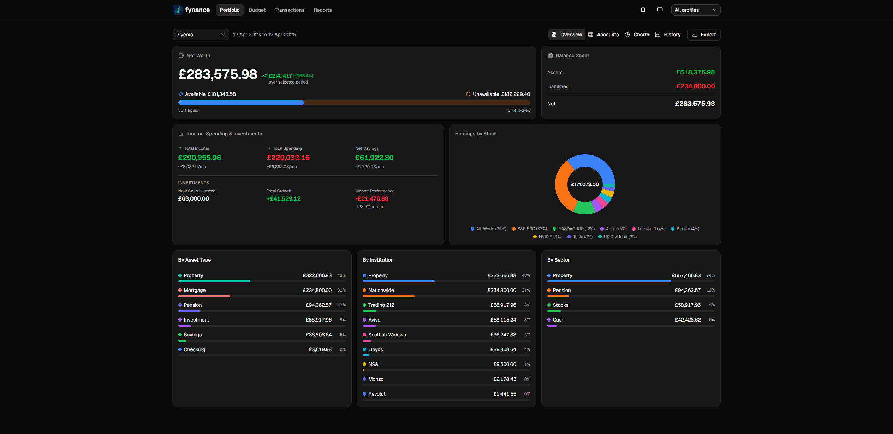
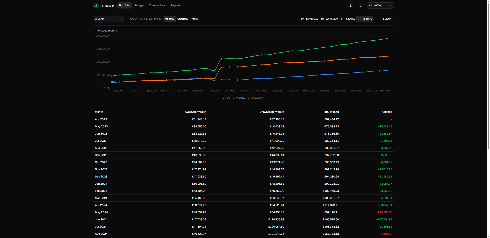
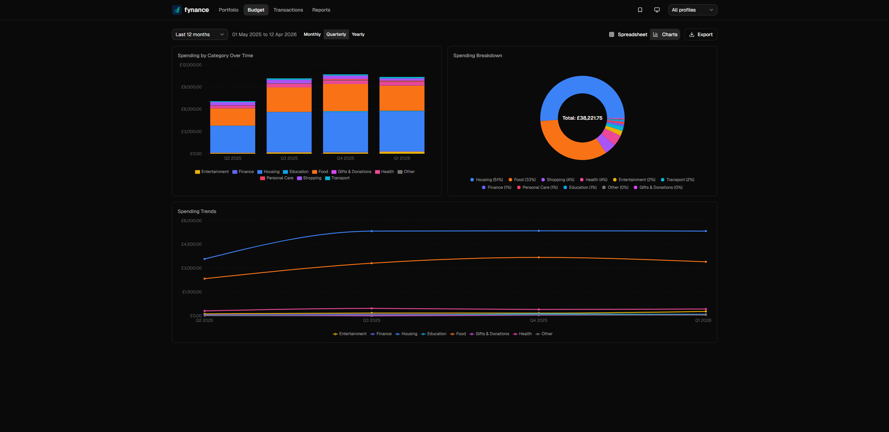
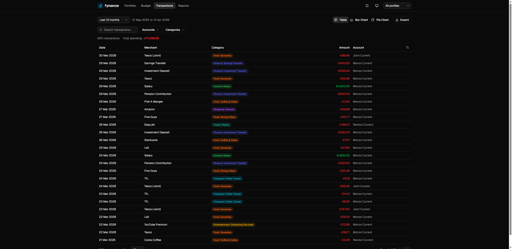

# fynance frontend

React 19 web UI for the fynance personal finance tracker.

[**View Live Demo**](https://fynance-3c.vercel.app)

## Screenshots

### Portfolio Overview
Net worth, income/spending/investments breakdown, holdings by stock, and asset allocation.



### Portfolio History
Wealth growth over time with available/unavailable split. Hover over table rows to highlight on the chart and vice versa.



### Budget Charts
Spending by category over time (stacked bar), spending breakdown (pie), and spending trends (line).



### Transactions
Searchable, filterable transaction table with colored category badges, configurable columns, and pagination.



## Stack

- React 19 + React Compiler (babel-plugin-react-compiler)
- Vite + TypeScript
- Tailwind CSS v4 + shadcn-ui (New York style, Zinc)
- Recharts for interactive charts (pie hover zoom, bar highlight, cursor-following tooltips)
- react-router-dom for client-side routing

## Development

```bash
npm install
npm run dev
```

Dev server runs at http://localhost:5173 with HMR. API calls to `/api/*` are proxied to the Rust backend at http://localhost:7433.

## Build

```bash
npm run build
```

Output goes to `dist/`, which is embedded into the Rust binary via `include_dir!`.

## Features

- **Portfolio**: Net worth tracking, available/unavailable wealth split, holdings drill-down, income/spending/investments card with market performance, allocation charts (by type, institution, sector, stock)
- **Budget**: Monthly spending spreadsheet with color-coded cells (green/amber/red vs budget), quarterly/yearly aggregation, stacked bar + pie + line charts
- **Transactions**: Paginated table with free-text search, multi-select filters (accounts, categories), colored category badges, configurable visible columns, configurable page size
- **Dark/light/system theme**: Stored in localStorage, respects system preference
- **URL-driven state**: All filters, views, and date ranges in URL search params (bookmarkable, refresh-safe)
- **Pinned views**: Save any URL as a named tab in the navbar
- **Configurable homepage**: Star icon on any tab to set it as default landing page
- **Profile selector**: Multi-profile support with joint accounts, persists across page navigation
- **Skeleton loading**: View-specific skeleton placeholders instead of spinners
- **Custom date ranges**: Clickable dates open calendar pickers, presets from 3 months to 10 years

## Structure

- `src/types/` -- TypeScript interfaces (will be auto-generated by ts-rs from Rust later)
- `src/data/` -- Mock data for development (removed when real API is wired up)
- `src/api/` -- API service layer with typed interface + mock implementation
- `src/hooks/` -- Custom hooks (URL filters, pinned views, theme, homepage)
- `src/components/` -- Shared components (navbar, charts, date picker, skeletons)
- `src/components/charts/` -- Recharts wrappers (InteractivePie, StyledBarChart, StyledLineChart)
- `src/pages/` -- Page-level components (one per tab)
- `src/lib/` -- Utilities (formatting, colors, aggregation)
